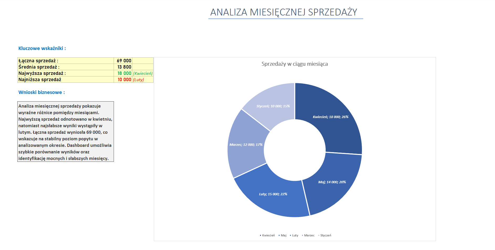

# Excel Sales Analysis 📊 

## Project Overview 
This project presents an Excel dashboard analyzing monthly sales performance. 
It focuses on key business metrics and clear visual insights. 

## Key Metrics 
- Total sales
- Average monthly sales
- Highest and lowest sales month

## Dashboard Preview 
 

## Tools Used 
- Microsoft Excel
- Pivot Tables
- Charts
- Business analysis

